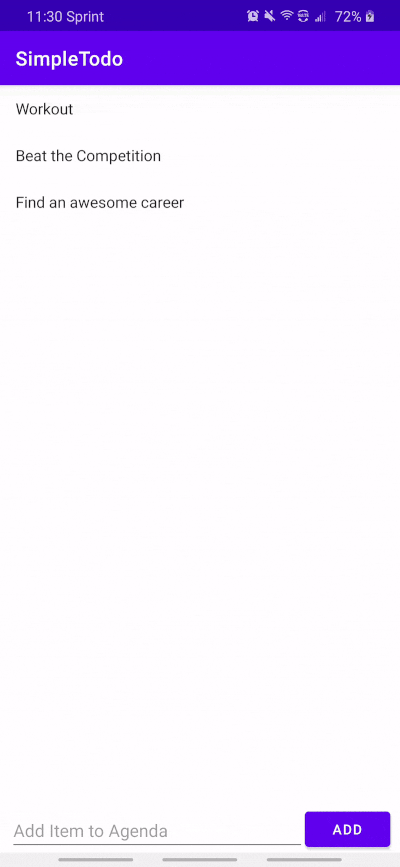

# Project 1 - *SimpleTodo*

**SimpleTodo** is an android app that allows building a todo list and basic todo items management functionality including adding new items, editing and deleting an existing item.

Submitted by: **Joseph Barshay**

Time spent: **3** hours spent in total

## User Stories

The following **required** functionality is completed:

* [x] User can **view a list of todo items**
* [x] User can **successfully add and remove items** from the todo list
* [x] User's **list of items persisted** upon modification and and retrieved properly on app restart

The following **optional** features are implemented:

* [x] User can **tap a todo item in the list and bring up an edit screen for the todo item** and then have any changes to the text reflected in the todo list

No additional features have been implemented, due to time constraints.

## Video Walkthrough

Here's a walkthrough of implemented user stories:

GIF created using EZGIF video-to-GIF service. Original video originally recorded on Samsung Galaxy A50 (personal device). Long taps are used to delete items in this case.

## Notes

Navigating the Android libraries for the first time was difficult, even with a walkthrough. Additionally, understanding the definition and usage of views, activities, and adapters is an area I will need to work on. Also, I have limited experience in XML, so I could follow along for the most part, but I would like to get a better understanding of it.

## License

    Copyright [2020] [Joseph Barshay]

    Licensed under the Apache License, Version 2.0 (the "License");
    you may not use this file except in compliance with the License.
    You may obtain a copy of the License at

        http://www.apache.org/licenses/LICENSE-2.0

    Unless required by applicable law or agreed to in writing, software
    distributed under the License is distributed on an "AS IS" BASIS,
    WITHOUT WARRANTIES OR CONDITIONS OF ANY KIND, either express or implied.
    See the License for the specific language governing permissions and
    limitations under the License.
